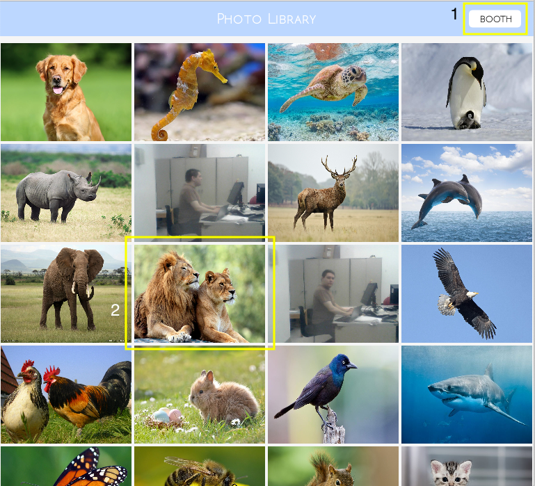

# Photo Booth/Editor
<b>Group Name:</b> Big Brains
<b>Group Members:</b> Grace Mao, Jackie Lin 

## Table of Contents 
<ul>
 <li>[Project Description](#project-description)</li>
 <li>[Instructions](#instructions)</li>
 <li>[Development Log](#development-log)</li>
</ul>

## Project Description 

The core of our final project is a Photo Booth/Editor created in Processing through the Capture class. Processing provides a unique opportunity for smooth graphics and a Photo Booth/Editor would efficiently use our resources to make a project that is both useful and aesthetic. In our Photo Booth/Editor, users will be able to, of course, take pictures of themselves and edit them afterwards. Features include adding filters in the photo booth and placing stickers in the editor. Additionally, images are able to be stored or deleted. Other features may be implemented depending on our usage of Processing and our ability to change the look of the camera.

## Instructions

1. After cloning the repository, open up the Main folder. 
2. Open Main.pde in Processing. 
3. Click the "run" button. 
4. You will start off in the library mode. You can tell which mode you're in by looking at the heading of the screen, which will read either "Photo Library", "Photo Booth", or "Photo Editor". 
    

(1) Click on this button to button to transition to the Photo Booth.  
(2) Click on any image to open it in Photo Editor. You can also scroll using your mouse to view other images in the library.
    

(1) Click on this button to transition to the Photo Library.   
(2) This is where the photo from the webcam will be displayed.   
(3) Click this button to capture a photo. If you click this button, more buttons will appear. (see next diagram)
    

(1) Click on this button to transition to the Photo Library. The photo you took will not be saved automatically.  
(2) Click on this button to open the photo you just took in the Photo Editor.   
(3) This is where the photo you just took will be displayed.  
(4) This button can still be clicked, but it will not be able to take new pictures until you click either save or cancel.   
(5) Click on this button to save the photo into the library and go back to capture mode. (see previous diagram)  
(6) Click on this button to discard the photo and go back to capture mode. (see previous diagram)
    

(1) Click on this button to transition to the Photo Booth.   
(2) Click on this button to transition to the Photo Library.   
(3) This is the image that will be edited.   
(4) This is the edit bar. Click on any of the buttons to switch the edit mode. The mode displayed in this diagram is "Color".   
(5) This is the right arrow button. Click on this to display more filters, stickers, or frames.  
(6) Click on this button to save your edited image and return to Photo Library.   
(7) Click on this button to cancel your edits and return to Photo Library. 
    

(1) This is edit mode 1. Click any of the images to apply the filter seen. Only one filter may be applied at a time (restriction includes the kernel filters). The available color filters are grayscale, redscale, orangescale, yellowscale, greenscale, bluescale, purplescale, and invert color (displayed in that order on the screen). Click the first image to remove any filters.
    

(1) This is edit mode 2, which displays kernel filters. Click any of the images to apply the filter seen. Only one filter may be applied at a time (restriction includes the color filters). The available kernel filters are blur, sharpen, edgeEnhance, edgeDetect, emboss, sobelEdge, horizontal line detector and vertical line detector (displayed in that order on the screen). Click the first image to remove any filters. 
    

(1) This is one of the three adjustment scrollbars. Click anywhere on the scrollbar or drag the slider to change its value.  
(2) After you finishing dragging the sliders, click this button to apply the adjustments to your image.  
(3) Click this button to reset your sliders and reset the image.
    

(1) This is edit mode 4. Click any of the images to apply the sticker. Any stickers added during the editing session may be moved around using mouse drag. To remove the sticker from your image, simply drag it out of the image into the surrounding area. 
    

(1) This is edit mode 5. Click any of the images to apply the frame to your image. Click the first image, which says "NONE", in order to remove all frames. Only one frame may be applied at a time during an editing session. 
    

(1) This is edit mode 6. The little circles filled with different colors make up the color palette. Click on any one of them to change the color of your pen. Using your pen, you can drag it over the image in order to draw on it.   
(2) Click this button to set your pen to erase mode. Now you can drag it over any drawings on the image made during the editing session to erase it.   
(3) Click this button to clear your image of all drawings made during the editing session. 
      

<b>Important Notes</b>
<ul>
 <li>Unless you explicitly click the save button, none of your images will be saved.</li>
 <li>DO NOT add stickers, or frames to the "Stickers" and "Frames" folders.</li> 
 <li>DO NOT add images to the "Images" folder externally whiling running the program.</li>
 <li>After you save an image, all the filters, stickers, adjustments, frames, and drawings become PART of the image. You cannot edit them again. </li>
 <li>The program may be a little laggy because there is a lot going on at once. That being said, DO NOT click a button you want to use multiple times just because there is a lag. It will not make the program run any faster, and the buttons are not built to handle multiple clicks at once. It will just perform the button action multiple times, which can cause problems for you. Also while the program is loading, DO NOT click any other buttons. It will make the program even more laggy. </li>
 <li>When you click the left or right arrow button, it affects every part of the edit bar, including the filters, stickers and frames.</li>
 <li>In the Photo Editor, only what is within the image will be saved. That means that if your sticker does not fit on the image it will be cut off. </li>
</ul>

## Development Log
<table>
  <th>Log Date</th>
  <th>Description</th>
  <tr>
    <td>5/19/19</td>
    <td>
    Grace: :octocat:
     <ul>
      <li>worked on filling in the Main folder by creating new classes</li>
    </ul> 
    Jackie: :hatched_chick:
     <ul>
      <li>created new repository</li>
      <li>formatted the README</li>
      <li>experimented with accessing a folder of images through directory list library</li>  
      <li>experimented with display data from webcam on screen using Capture class</li>
      </ul> 
    </td>
  </tr>
  <tr>
    <td>5/20/19</td>
    <td>
    Grace: :octocat:
     <ul>
      <li>worked on getting to know the webcam and its proportions, along with displaying image on school computers and laptop</li>
      <li>worked on implementing the rest of the empty classes and working on the Button class</li>
      <li>fixed merge issues</li>
    </ul> 
    Jackie: :hatched_chick:
     <ul>
      <li>experimented with displaying all images from a folder on the screen (resizing and translation)</li>
      worked with the Button class and changing the camera size as well as taking pictures</li>
      <li>experimented with listing out file names </li>
      <li>downloaded images for testing purposes
    </ul> 
      <i> Additional Notes: ran into trouble with school computers and webcam</i>
    </td>
  </tr>
  <tr>
    <td>5/21/19</td>
    <td>
    Grace: :octocat:
     <ul>
      <li>created new ButtonClass class, added instance variables and method headers to it</li>
      <li>experimented with mouseClick method in order to use button to take a picture</li>
      <li>edited instance variables in Main</li>
    </ul> 
    Jackie: :hatched_chick:
     <ul>
      <li>experimented with setup (including size of screen, size of capture area)</li>
      <li>worked with Grace to move experimental code into Main class (especially the Capture class)</li>
    </ul> 
      <i>Note: tried to implement mouseClick method in ButtonClass, which didn't work, will be moved to Main</i>
    </td>
  </tr>
  <tr>
    <td>5/22/19</td>
    <td>
    Grace: :octocat:
     <ul>
      <li>studied mouseClick documentation and experimented with it (very frustrating!!!)</li>
    </ul> 
    Jackie: :hatched_chick:
     <ul>
      <li>experimented with pseudocode from Processing tutorials to use mouseClick </li>
      <li>added new instance variables and constructors in ButtonClass, defined two new shapes for buttons</li>
      <li>wrote methods in ButtonClass to check if mouse was over a button and/or clicking a button</li>
    </ul> 
    </td>
  </tr>
  <tr>
    <td>5/24/19</td>
    <td>
    Grace: :octocat:
     <ul>
      <li>implemented an ArrayList of buttons in the Main class </li>
      <li>correctly implemented the Button class using the mouseClicked method and moved Jackie's previous code into the Main</li> class
    </ul> 
    Jackie: :hatched_chick:
     <ul>
      <li>adjusted the setup method, experimented with size and shapes </li>
      <li>wrote a method to take screenshots to be saved in the Images folder</li>
    </ul> 
    </td>
  </tr>
  <tr>
    <td>5/25/19</td>
    <td>
    Grace: :octocat:
     <ul>
      <li> updated formatting of README</li>
    </ul> 
    Jackie: :hatched_chick:
     <ul>
      <li>added contracting effect to capture button to be activated upon mouseClick </li>
      <li>adjusted Booth Mode so that only a portion of the screen is captured and saved</li>
    </ul> 
    </td>
  </tr>
  <tr>
    <td>5/26/19</td>
    <td>
    Grace: :octocat:
     <ul>
      <li>taking a well-deserved break :) </li>
      <li>ha very sick</li>
    </ul> 
    Jackie: :hatched_chick:
     <ul>
      <li>regrouped Buttons from different modes in different ArrayLists </li>
      <li>worked in Library Mode to figure out dimensions for displaying images, also added a header</li>
      <li>read documentation for mouseWheel and added scrolling feature</li>
    </ul> 
    </td>
  </tr>
  <tr>
    <td>5/27/19</td>
    <td>
    Grace: :octocat:
     <ul>
      <li>taking a well-deserved break :) </li>
      <li>still sick</li>
    </ul> 
    Jackie: :hatched_chick:
     <ul>
      <li>started formatting edit mode, edited formats of other two modes </li>
      <li>added new type of button (redirect)</li>
      <li>wrote code so that redirect button functioned</li>
      <li>added more images for demonstration purposes</li>
    </ul> 
    </td>
  </tr>
  <tr>
    <td>5/28/19</td>
    <td>
    Grace: :octocat:
     <ul>
      <li>create new buttons to switch between modes</li>
      <li>froze image in booth mode after capturing</li>
      <li>worked on creating save and cancel button (pair programming)</li>
      <li>worked on skeleton code for transitioning from library to editor</li>
      <li>formatted editor mode</li>
    </ul> 
    Jackie: :hatched_chick:
     <ul>
      <li>modified save and cancel button (pair programming)</li>
      <li>transferred methods from main into new classes devote to the three modes</li>
      <li>fixed issue with scrolling when transitioning from library to editor</li>
      <li>fixed issue with resize in editor mode (formatting)</li>
      <li>added new image samples </li>
    </ul> 
    </td>
  </tr>
  <tr>
    <td>5/29/19</td>
    <td>
    Grace: :octocat:
     <ul>
      <li>read very complicated documentation about kernel image processing</li>
    </ul> 
    Jackie: :hatched_chick:
     <ul>
      <li>read very complicated documentation about kernel image processing</li>
      <li>created a few new buttons in booth and editor mode to facilitate the transition between modes</li>
    </ul> 
    </td>
  </tr>
  <tr>
    <td>5/30/19</td>
    <td>
    Grace: :octocat:
     <ul>
      <li>wrote version of convolution and edited the correct version
      </li>
      <li>wrote greyscale and added to filters class</li>
      <li>experimented with different kernels and filters</li>
      <li>tried to fix blurring to make it less subtle</li>
    </ul> 
    Jackie: :hatched_chick:
     <ul>
      <li>wrote the pseudocode for processing every pixel of an image through kernels (convolute method)</li>
      <li>experimented with different kernels and filters</li>
      <li>wrote color filters such as redscale, greenscale and invert</li>
    </ul> 
    </td>
  </tr>
  <tr>
    <td>5/31/19</td>
    <td>
    Grace: :octocat:
     <ul>
      <li>started to implement stickers to appear</li>
      <li>setup the mouseClicked, mousePressed, and mouseReleased for stickers</li>
    </ul> 
    Jackie: :hatched_chick:
     <ul>
      <li>adjusted and created the edit bar for filters, worked on color filter (filterMode 1)</li>
      <li>worked on implementing buttons for each filter</li>
    </ul> 
    </td>
  </tr>
  <tr>
    <td>6/1/19</td>
    <td>
    Grace: :octocat:
     <ul>
      <li>implemented mouse drag of stickers</li>
      <li>created dog sticker button</li>
      <li>fixed bugs so that multiple stickers could be made with the buttons</li>
      <li>user now able to save pictures with the stickers</li>
    </ul> 
    Jackie: :hatched_chick:
     <ul>
      <li>fixed merge errors</li>
    </ul> 
    </td>
  </tr>
  <tr>
    <td>6/2/19</td>
    <td>
    Grace: :octocat:
     <ul>
      <li>debugged stickers and editor mode</li>
      <li>corrected, updated, and made edits to prototype</li>
    </ul> 
    Jackie: :hatched_chick:
     <ul>
      <li>implemented the clickable edit bar with filters and added a filterMode variable</li>
      <li>eliminated extra code</li>
      <li>added a revert button</li>
      <li>modified color filter methods</li>
      <li>added variables and methods to make edit bar navigable with left and right scroll buttons</li>
      <li>added a kernel filterMode to the edit bar (filterMode 2)</li>
    </ul> 
    </td>
  </tr>
  <tr>
    <td>6/3/19</td>
    <td>
    Grace: :octocat:
     <ul>
      <li>worked on editing prototype and started new UML diagram</li>
    </ul> 
    Jackie: :hatched_chick:
     <ul>
      <i> deadline is almost upon us but diamonds are made under pressure :) </i>
      <li>added new kernels that detect horizontal and vertical lines in image, edited existing kernels</li>
      <li>made kernel filterMode clickable/functional</li>
      <li>added functional buttons to navigate between different filterModes in edit bar</li>
      <li>wrote algorithms to change brightness, saturation and contrast of picture</li>
      <li>wrote a new ScrollBar class to be used in adjustments (filterMode 3), referenced HScrollbar documentation on Processing website</li>
      <li>added scrollbars and read values from these scrollbars to change brightness, saturation and contrast of picture (filterMode 3)</li>
      <li>wrote an apply_adj() function that overlays applied filters and adjustments on the image (as opposed to them being mutually exclusive as they were previously)</li>
      <li>created a new apply and reset button in filterMode 3 related to the apply_adj() function</li>
      <li>removed unnecessary files</li>
      <li>experimented with drawing on a PGraphics buffer, referenced documentation</li>
      <li>added a PGraphics buffer on top of to_edit image (filterMode 6)</li>
      <li>added a clickable color palette for draw mode (filterMode 6), also added a clear button to clear all drawings </li>
      <li>added new frame class and added new photo frame images (code very similar to code for loading images in library)</li>
      <li>displayed photo frames in edit bar (filterMode 5) and added buttons underneath</li>
      <li>made buttons clickable to apply a photoframe</li>
      <li>debugged the left, right scroll buttons in edit bar</li>
    </ul> 
    </td>
  </tr>
  <tr>
    <td>6/4/19</td>
    <td>
    Grace: :octocat:
     <ul>
      <li>finished editing prototype and new UML diagram</li>
      <li>found stickers to add to the panel in editor mode</li>
      <li>successfully implemented the sticker panel for all six stickers</li>
      <li>adjusted size of stickers</li>
      <li>fixed order of frames in the editor panel</li>
      <li>adjusted the placement of stickers when first created</li>
    </ul> 
    Jackie: :hatched_chick:
     <ul>
      <li>added a button to get rid of photo frame</li>
      <li>edited the reset_editor function to reset stickers and drawings everytime editor is opened</li>
      <li>added code so that only one sticker and scrollbar can be dragged at a time </li>
      <li>added code to allow sticker edit bar to be adjusted with left/right arrow buttons</li>
      <li>added new stickers and wrote code to make those stickers functional</li>
      <li>added an erase button in draw mode in the edit bar</li>
      <li>added comments to the code, removed unnecessary code</li>
      <li>updated instructions for running the program</li>
    </ul> 
    </td>
  </tr>
</table>
